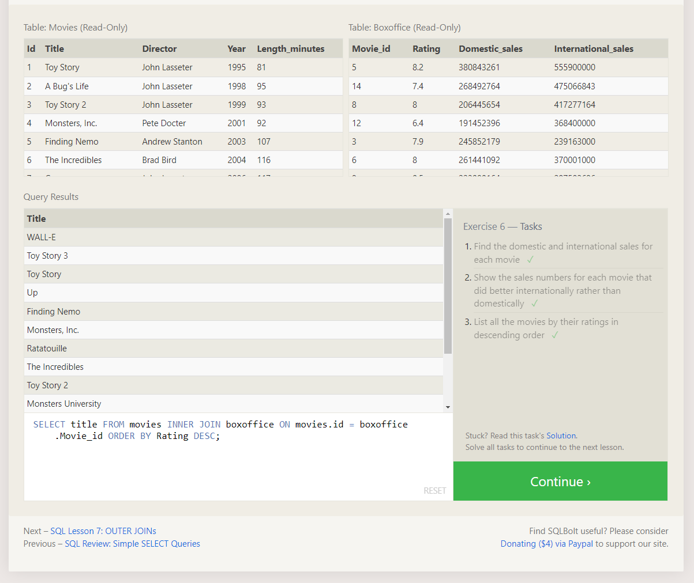

#  Introduction to SQL

## _What Is SQL?_

`SQL`, or **S**tructured **Q**uery **L**anguage, is a language designed to allow users to manipulate and transform data from a **relational** database.
They are simple, safe and they are scalable!  SQL databases are used by millions of websites and mobile applications.

I mentioned "relational", what does that mean exactly?  `SQL` databases represent connected, or "related" two dimensional tables.  These tables can be connected to eachother, either by a zero/one to many, or a zero/one to one relationship.

## SQL Syntax Example

``` 
// Select a query for all columns

SELECT * FROM <your-table>
```
## Tutorial Screenshots





## Resources

[Download Learn SQL E-Book](https://landing.chartio.com/download-learn-sql)

[SQL Bolt](https://sqlbolt.com/)